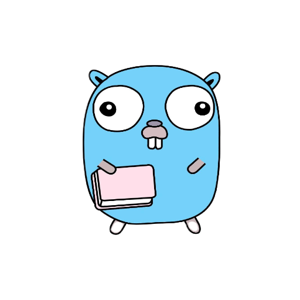

# GO LEARN

## v4
Alana

## Goals

- Github Actions deploy of a [mkdocs.org](https://www.mkdocs.org) site
- [protobuf](https://github.com/golang/protobuf) generation example (Gradle Tooling API artifact model)

