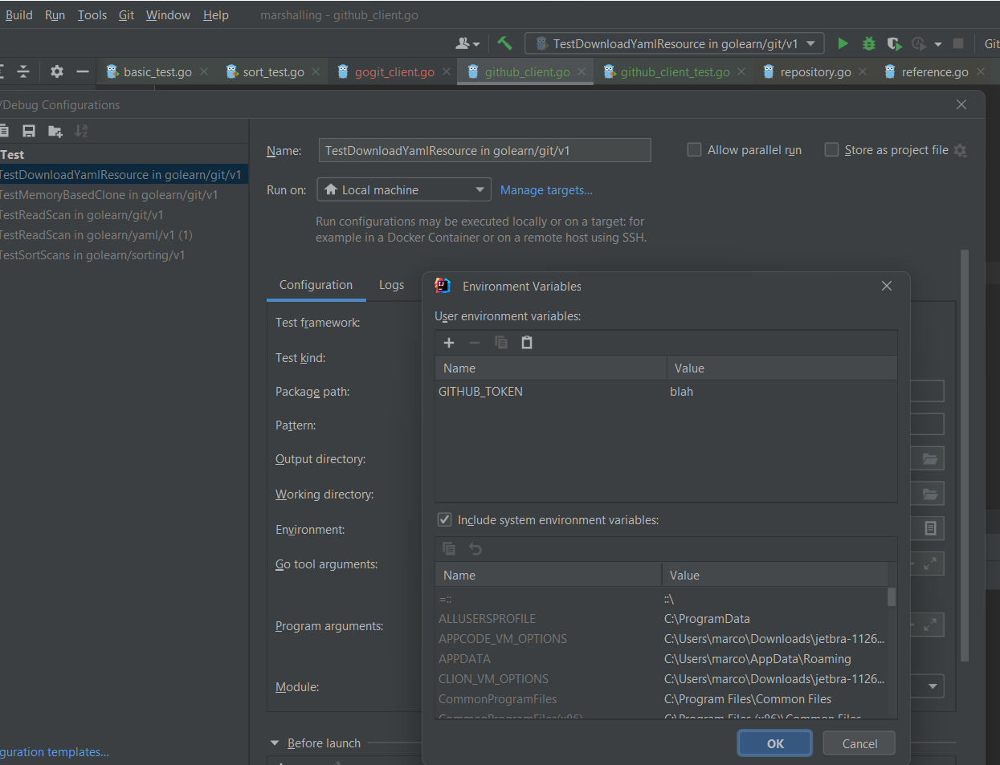
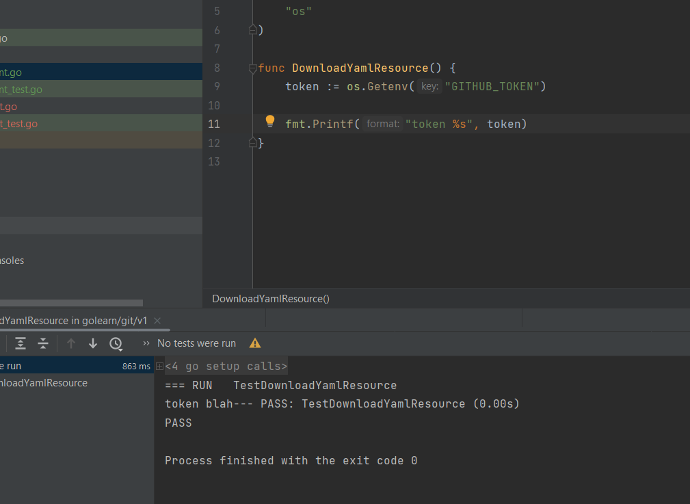

# Testing in Go

[Testing in Go](https://pkg.go.dev/testing)

[Add a test](https://go.dev/doc/tutorial/add-a-test)

[Assertions](https://pkg.go.dev/github.com/stretchr/testify/assert#Contains)

## TearDown suite

[Setup and teardown](https://medium.com/nerd-for-tech/setup-and-teardown-unit-test-in-go-bd6fa1b785cd)


**github_client_test.go**

```go

func setupSuite(tb testing.TB) func (tb testing.TB) {
log.Println("setup suite")

err := os.RemoveAll("foo")
if err != nil {
return nil
}

// Return a function to teardown the test
return func (tb testing.TB) {
log.Println("do the cleanup")
err = os.RemoveAll("foo")

log.Println("teardown suite")
}
}

func TestReadScan(t *testing.T) {

teardownSuite := setupSuite(t)
defer teardownSuite(t)

StandardGitClone()

assert.DirExists(t, "foo")
}
```
## Passing environment variables

The easiest way if via Run configurations



Then use os.GetEnv(key)

```go
package v1

import (
	"fmt"
	"os"
)

func DownloadYamlResource() {
	token := os.Getenv("GITHUB_TOKEN")

	fmt.Printf("token %s", token)
}
```


